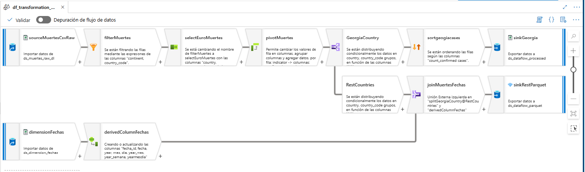

markdown

# ?? Modulo 01: Azure Data Factory - Mapping Data Flows Avanzado

En este laboratorio practico implemente un proceso **ETL completo sin codigo** utilizando **Mapping Data Flows**. La logica se ejecuta de forma distribuida sobre un cluster de Spark administrado por Azure.

## ?? Arquitectura del Flujo de Datos

  

### ?? Componentes y Transformaciones del Laboratorio

El pipeline realiza las siguientes operaciones secuenciales sobre los datos:

1.  **`Source 1 (Dataset/Data Lake - CSV)`**: Extraccion de los datos crudos en formato CSV desde Azure Data Lake Storage (ADLS).
2.  **`Filter`**: Limpieza inicial filtrando filas segun condiciones especificas de los campos.
3.  **`Select Mapping`**: Optimizacion del esquema. Se renombraron campos para cumplir con los estandares de negocio y se eliminaron las columnas innecesarias.
4.  **`Pivot`**: Transformacion de filas en columnas. Se tomaron los valores de una columna especifica para pivotarlos y generar nuevas columnas metricas.
5.  **`Conditional Split`**: Division del flujo de datos en dos caminos independientes basados en reglas de negocio especificas.
6.  **`Source 2 (Dim_Fechas - CSV)`**: Carga de una nueva fuente de datos desde ADLS que contiene la dimension de tiempo (Fechas).
7.  **`Derived Column`**: Creacion de una llave compuesta/columna calculada mediante la concatenacion de campos existentes.
8.  **`Join`**: Combinacion (Lookup/Join) del flujo principal con la dimension fechas utilizando la columna generada en el paso anterior. Se seleccionaron unicamente los campos finales requeridos.
9.  **`Sort`**: Ordenamiento del conjunto de datos resultante basado en una condicion logica.
10. **`Sinks (Destinos de Datos)`**:
    *   **Ruta A (CSV):** Exportacion a Azure Data Lake en formato de texto.
    *   **Ruta B (Parquet - Particion unica):** Exportacion a ADLS optimizada en formato Parquet, forzando una particion unica (`Single Partition`) para generar un solo archivo consolidado.

---

## ??? Orquestacion y Optimizacion del Pipeline

Para llevar este flujo a produccion, se configuraron los siguientes componentes de infraestructura y monitoreo:

*   **Integration Runtime (IR) Optimizado:** Para reducir costos de computo, se preconfiguro un Azure IR optimizado para ahorro con un tama?o de cores minimo y un **TTL (Time to Live)** corto. Esto permite reutilizar el cluster de Spark entre ejecuciones rapidas sin pagar tiempo muerto de encendido.
*   **Trigger Schedule (Disparador Programado):** Automatizacion del pipeline mediante una programacion horaria/diaria para simular una carga de datos periodica.
*   **Trazabilidad en Monitor:** Monitoreo activo desde la pesta?a *Monitor* de ADF, analizando los tiempos de ejecucion, numero de filas procesadas por etapa y estados de ¨¦xito/error del Trigger.

---

## ?? Archivos de Codigo (JSON)

Puedes importar y estudiar el dise?o exacto de este laboratorio utilizando los archivos JSON adjuntos en la carpeta de codigo:
*   [Definicion del Pipeline](./codigo/pipeline-dataflow.json)
*   [Logica del Mapping Data Flow](./codigo/mapping-dataflow.json)