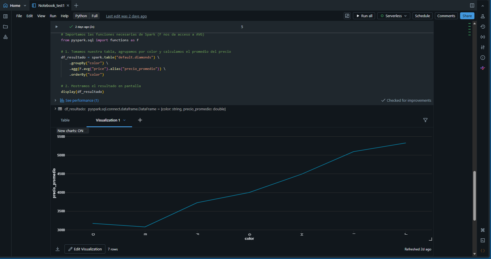

# 🚀 Mi Primer Laboratorio en Databricks: Procesamiento de Datos con PySpark y SQL

## 📝 Descripción
Este repositorio contiene una guía práctica paso a paso para dar los primeros pasos en **Databricks Free Edition**, cubriendo desde la preparación del entorno hasta la ingesta de datos, análisis mediante consultas y visualización avanzada. 

El objetivo es simular un flujo de Big Data moderno donde los datos brutos se transforman en tablas Delta optimizadas.

---

## 🛠️ Paso a Paso del Laboratorio

### 1. Configuración del Entorno
* Creación de la estructura de trabajo mediante la carpeta `test1`.
* Creación del cuaderno de trabajo `notebook_test1` utilizando el motor **Serverless Compute** (`Default interactive compute`).

### 2. Ingesta de Datos y Creación de Tablas
Para este laboratorio se utilizó el dataset público de diamantes alojado en el sistema. Se migró el flujo tradicional a comandos compatibles con la gobernanza moderna de datos:

```python
# Lectura del dataset bruto utilizando PySpark
df_diamonds = spark.read.format("csv") \
    .option("header", "true") \
    .option("inferSchema", "true") \
    .load("dbfs:/databricks-datasets/Rdatasets/data-001/csv/ggplot2/diamonds.csv")

# Registro y persistencia de los datos en formato Delta Lake nativo
df_diamonds.write.mode("overwrite").saveAsTable("default.diamonds")
```

### 3. Análisis de Datos (SQL vs. PySpark)
Se ejecutó una agregación para determinar el precio promedio de los diamantes agrupados por su color, ordenados alfabéticamente.

**Consulta en PySpark:**
```python
from pyspark.sql import functions as F

df_resultado = spark.table("default.diamonds") \
    .groupBy("color") \
    .agg(F.avg("price").alias("precio_promedio")) \
    .orderBy("color")

display(df_resultado)
```

### 4. Visualización de Resultados
A partir del procesamiento anterior, se generó un gráfico de lineas interactivo dentro de Databricks para analizar las tendencias de precios.

<p align="center">
  
</p>

* **Conclusión del análisis:** Los diamantes de color **J e I** presentan el precio promedio más alto, rompiendo la tendencia lineal esperada y sugiriendo un mayor tamaño (carat) promedio en estas muestras.

---

## ⚠️ Desafíos Técnicos y Soluciones (Notas Adicionales)

Durante el desarrollo del laboratorio original del curso, se presentaron dos restricciones arquitectónicas clave que requirieron adaptar la solución:

1. **Restricción de Azure Student Account:** La suscripción estudiantil bloquea la creación de clusters tradicionales de Databricks debido a límites estrictos de vCPUs. 
   * *Solución:* Se migró la práctica a **Databricks Free Edition**, operando bajo un modelo conceptual donde Azure Data Factory realiza la ingesta al Data Lake y Databricks procesa de forma independiente.
2. **Error `UC_FILE_SCHEME_FOR_TABLE_CREATION_NOT_SUPPORTED`:** Los entornos modernos de Databricks Serverless integran **Unity Catalog** por defecto, lo que prohíbe la creación directa de tablas apuntando a rutas raíz tradicionales (`dbfs:/...`) usando SQL legacy (`CREATE TABLE USING CSV`).
   * *Solución:* Se reemplazó el enfoque de la guía por un pipeline de **PySpark (Python)** para leer el archivo en memoria como un DataFrame y posteriormente guardarlo con `.saveAsTable()`, permitiendo que el catálogo administrara la tabla automáticamente bajo el formato estándar **Delta Lake**.
