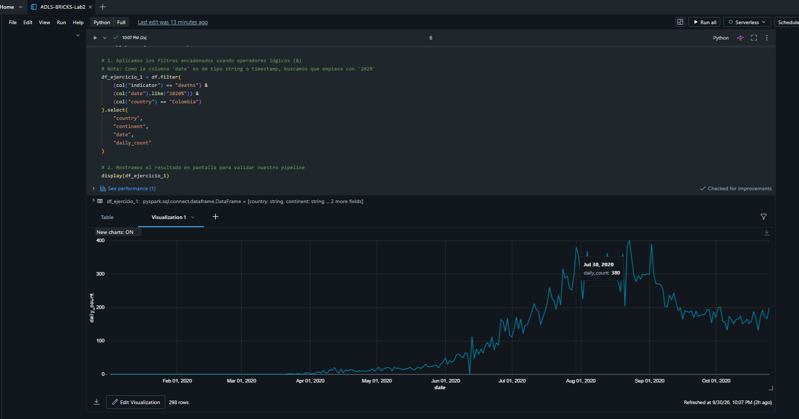
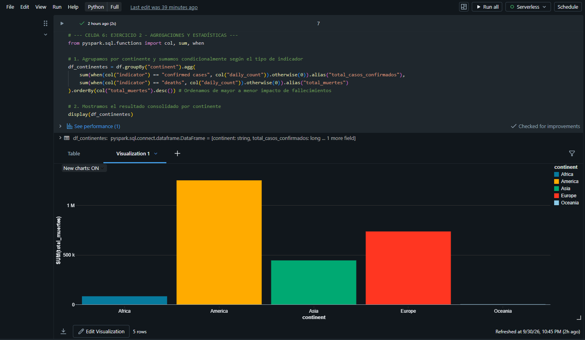
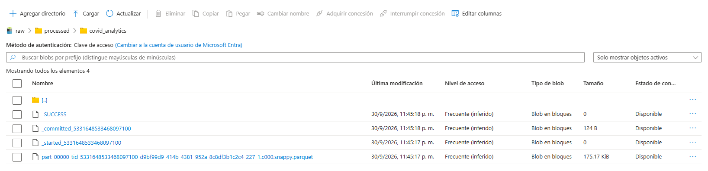

# Azure Data Engineering Lab: Data Pipelines con Databricks y ADLS Gen2 🚀

Este proyecto documenta la segunda fase del **Laboratorio 2**, donde se diseñó e implementó un pipeline de extracción, transformación y carga (**ETL**) utilizando **Apache Spark (PySpark)** y **Databricks**, conectado de forma segura a un **Azure Data Lake Storage Gen2 (ADLS)** bajo una arquitectura orientada a Big Data.

## 🛠️ Arquitectura y Tecnologías
*   **Origen de Datos:** Azure Data Lake Storage (ADLS Gen2) - Capa Raw (CSV).
*   **Procesamiento:** Azure Databricks (Clúster de un solo nodo / Spark 3.x).
*   **Lenguajes:** PySpark (Spark SQL API) y SQL Ansel de forma híbrida.
*   **Destino de Datos:** ADLS Gen2 - Capa Processed (Formato Parquet optimizado).

---

## 📈 Fases del Pipeline Implementado

### 1. Extracción y Persistencia Híbrida
Se consumió la data bruta de COVID-19 (`muertes.csv`) mediante autenticación efímera con Service Principal hacia Azure. Con la finalidad de optimizar el laboratorio y habilitar capacidades de Business Intelligence, la data en memoria se persistió en el Metastore de Databricks:
```python
# Persistencia en catálogo local
df.write.mode("overwrite").saveAsTable("tabla_covid_laboratorio")
```
Se validó la consistencia estructural usando comandos SQL nativos:
```sql
%sql
DESCRIBE TABLE tabla_covid_laboratorio;
```

### 2. Transformación y Enriquecimiento de Datos (ETL)
El pipeline ejecutó transformaciones secuenciales escalables para responder a necesidades críticas de análisis:

*   **Filtrado y Selección:** Aislamiento de curvas epidemiológicas específicas (ej. Fallecimientos en Colombia, año 2020) utilizando predicados lógicos optimizados (`.filter()`, `.like()`).
<p align="center">
  
</p>
*   **Agregación Condicional (Pivotado):** Consolidación de métricas distribuidas verticalmente (filas) hacia una estructura horizontal resumida por continentes, identificando a **América** como la región de mayor impacto con más de 1.25M de decesos.



*   **Métricas Relativas vs Cuantitativas:** Creación de la columna derivada `porcentaje_poblacion_afectada` para normalizar el impacto del virus omitiendo el sesgo del volumen poblacional:
    \[\text{Porcentaje} = \left( \frac{\text{daily\_count}}{\text{population}} \right) \times 100\]
*   **Auto-Join Complejo:** Transformación estructural de la data uniendo dos sub-dataframes (`casos` y `muertes`) mediante una llave compuesta (`country`, `date`) para aplanar el modelo de datos.

### 3. La Cereza del Pastel: Time Intelligence en Big Data
Para evitar cálculos pesados en herramientas de visualización como Power BI, se pre-calculó el desfase temporal directamente en el pipeline en la nube. Utilizando **Funciones de Ventana (Window Functions)**, se implementó un `LAG` para contrastar el comportamiento del día actual frente al día anterior por cada país:
```python
ventana_pais = Window.partitionBy("country").orderBy("date")
df_final = df_resultado_pipeline.withColumn("muertes_dia_anterior", lag("muertes_diarias", 1).over(ventana_pais))
```

### 4. Carga de Datos (Almacenamiento Distribuido)
El resultado final analítico fue exportado de vuelta al Data Lake de Azure en formato **Parquet**. La operación fue exitosa, validada por la generación automática del archivo de metadatos `_SUCCESS` y archivos partidos distribuidos (`part-*.parquet`), garantizando alta compresión y transaccionalidad atómica.


---

## 💡 Conclusiones del Laboratorio
*   **Normalización Analítica:** Evaluar impactos en términos porcentuales nivela el terreno de juego, exponiendo la verdadera vulnerabilidad de comunidades pequeñas que el análisis cuantitativo absoluto suele ocultar.
*   **Arquitectura Medallón:** Pasar datos de formatos planos (`.csv`) a formatos columnares binarios (`.parquet`) en capas refinadas (`processed`) optimiza drásticamente los costos de almacenamiento y los tiempos de cómputo en la nube.
